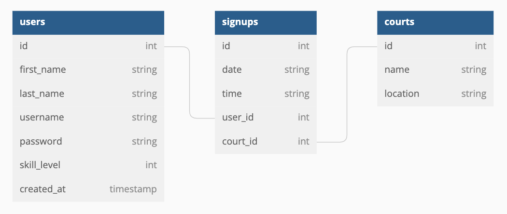

# 🏓 Phase 4 Project: Picklr 🏓

## App Story
Pickleball is the hot new racket sport that _everyone_ is talking about. In NYC, it can be hard to find available court space and book time to play. This app is designed to make reserving a pickleball court easy and fun. Picklr makes it faster than ever for novice and pro Picklers alike to sign up for court time, meet other athletes in the five boroughs, and play some Pickle!
## Deliverables and Stretch Goals
- **MVP**: As a user, I can:
  - Log into the site
  - View a list of all courts (**READ** /courts)
  - View a list of all of my reservations (**READ** /reservations)
  - Reserve a court at a specific date and time (**CREATE** /reservations/:id)
  - Modify the date and time of my reservation (**UPDATE** /reservations/:id)
  - Cancel a reservation (**DELETE** /reservations/:id)
- **Stretch**: As a user, I can:
  - Only have five active reservations at a time
  - Only signup with a partner who has the same skill level as I do
  - View pickleball courts on a map

## Models and Relationships


## Routes

* https://picklr-app.herokuapp.com/home
* https://picklr-app.herokuapp.com/new
* https://picklr-app.herokuapp.com/view

## Instructions for Testing/Updating Production

Start the server:

```console
rails s
```
Start the localhost React client:

```console
npm start --prefix client
```

Push to GitHub and Heroku:

```console
git add .
git commit -m 'message'
git push origin main
```